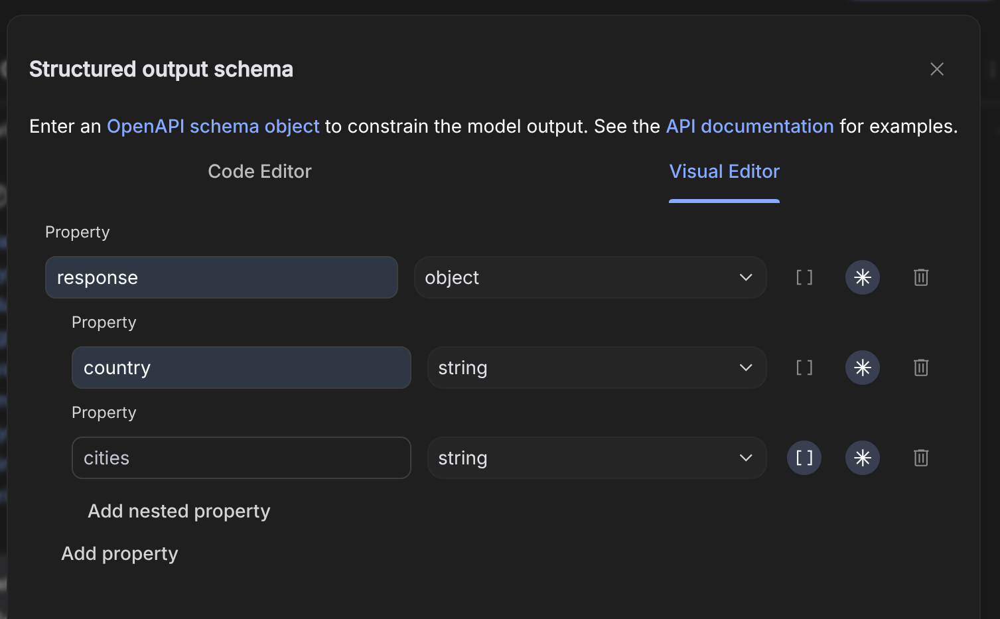

# 02 Spring AI Essentials   Prompts, Advisors, And Structured Responses

Sections-
1. [Understanding Message Roles in LLMs](#1-understanding-message-roles-in-llms)
2. [Understanding Message Roles in Spring AI](#2-understanding-message-roles-in-spring-ai)
3. [Understanding and Using Defaults in Spring AI](#3-understanding-and-using-defaults-in-spring-ai)
4. [Prompt Templates in Spring AI](#4-prompt-templates-in-spring-ai)
5. [Large Language Model Applications: Prompt Stuffing](#5-large-language-model-applications-prompt-stuffing)
6. [Why Prompt Stuffing Isn't Always the Answer](#6-why-prompt-stuffing-isnt-always-the-answer)
7. [The Beauty of Spring: Advisors in Spring AI](#7-the-beauty-of-spring-advisors-in-spring-ai)
8. [Configuring Advisors in Spring AI](#8-configuring-advisors-in-spring-ai)
9. [Building a Custom Token Usage Audit Advisor](#9-building-a-custom-token-usage-audit-advisor)
10. [Understanding and Configuring Chat Options in Spring AI](#10-understanding-and-configuring-chat-options-in-spring-ai)
11. [Configuring Chart Options in Spring AI](#11-configuring-chart-options-in-spring-ai)
12. [Exploring Different Response Handling Methods in Spring AI](#12-exploring-different-response-handling-methods-in-spring-ai)
13. [Creating a Stream Controller](#13-creating-a-stream-controller)
14. [Structured Output Converter](#14-structured-output-converter)
15. [Using Spring AI to Request LM Model Responses in POJO Format](#15-using-spring-ai-to-request-lm-model-responses-in-pojo-format)
16. [Implementing Structured Responses with List and Map Output Converters](#16-implementing-structured-responses-with-list-and-map-output-converters)
17. [Handling Complex Requirements: Returning a List of Custom Java Pojo Objects from LLM](#17-handling-complex-requirements-returning-a-list-of-custom-java-pojo-objects-from-llm)


---

## 1. Understanding Message Roles in LLMs

So far, we've built a simple Spring AI application that sends prompts and receives responses from LLM models like OpenAI and Ollama. This is a good start, but it only scratches the surface of what Spring AI can do.

Spring AI offers many advanced concepts that can help us make our enterprise Spring Boot applications more intelligent by integrating with LLM models. In the coming lectures, we'll explore these concepts, including:

- Message roles
- Advisors
- Prompt templates
- Chat history management
- Function calling
- Building MCP clients and servers

By the end of this course, we'll unlock the full potential of generative AI with Spring AI.

Let's focus on message roles in this section.

### What are Message Roles?

When interacting with LLMs used by applications like ChatGPT, we send prompts made up of messages. Each message has a **role** that helps the LLM understand the context and how to respond. By using these roles, we provide more meaningful information to the LLM, leading to better responses. 🤖

These are the most common roles supported by most LLMs:

- User
- System
- Assistant
- Function

Let's explore each of these in more detail.

### Common Message Roles

1.  **User Role:** This is the default role for messages sent by the user. 📌 **Example:** "Tell me a joke."
2.  **System Role:** This role allows us to provide instructions to the LLM on how it should behave. 📌 **Example:** "Be formal and professional when responding."
3.  **Assistant Role:** This role is assigned to the LLM's responses to user questions and system instructions. These models are assistants to humans, hence the name.
4.  **Function Role:** This role allows us to give special instructions on how to run a function or fetch data from our storage systems. This is related to the advanced concept of **function calling**. With function calling, we can expose functions or tools to the LLM models, which they can invoke to read data from our storage systems. We'll explore function calling in more detail later.

📌 **Example:** Before starting a chat with an LLM:

-   **System Role:** "You are a friendly tour guide."
-   **User Role:** "What are the top three places to visit in Rome?"
-   **Assistant Role:** (The LLM's response listing the top three places).

### Analogy: Message Roles as a Stage Play

To better understand message roles, consider a stage play:

-   **System Role:** The director giving stage instructions (e.g., "Act like a professional chef").
-   **User Role:** The audience asking a question (e.g., "How do I cook pasta?").
-   **Assistant Role:** The actor replying to the question (e.g., "Boil water and add pasta for eight minutes").
-   **Function Role:** A backstage helper fetching the required ingredients or recipes.

### LLM Support for Message Roles

⚠️ **Warning:** Not all LLM models support all message roles.

| LLM Model | User Role | System Role | Assistant Role | Function Role |
|-----------|-----------|-------------|----------------|---------------|
| OpenAI    | ✅        | ✅          | ✅             | ✅            |
| Anthropic | ✅        | ✅          | ✅             | ❌            |
| Google Gemini | ✅        | ❌          | ✅             | ❌            |

-   **OpenAI:** Supports all roles (user, system, assistant, and function).
-   **Anthropic:** Supports user, system, and assistant roles, but not function.
-   **Google Gemini:** Supports only user and assistant roles (the assistant role is sometimes called the "model" role).

Based on the LLM you're using, you need to understand which message roles are supported and build your business logic accordingly.

💡 **Tip:** Spring AI can help you manage these differences. For example, if you send a system role message to Google Gemini (which doesn't support it), Spring AI will combine the system message into the user message behind the scenes.

This is all the theory for now. In the next lecture, we'll write some code to send various message roles to an LLM. 🚀

---

## 2. Understanding Message Roles in Spring AI

This section explores how Spring AI handles different message roles when interacting with Language Models (LM). We'll cover how user and system messages are treated and how to leverage them effectively.

We'll create a project named [spring-ai](/sec02/spring-ai/). This project currently contains a simple "Hello World" logic, similar to what we've used previously.

The `ChatController` creates a `ChatClient` bean using the `ChatClientBuilder` and injects it. The application then invokes the LM model using the `prompt` method, passing a user message. The OpenAI API key is configured in `application.properties`.

Go to the home directory of the project and run the application:

```bash
mvn clean install
OPENAI_API_KEY=sk-xxxxxx mvn spring-boot:run
```

### Sending System and User Messages Separately 🗣️

Currently, we're sending the user's prompt directly to the `prompt` method without differentiating message roles. Let's examine what happens behind the scenes when using the `prompt` method with a string data type.

The logic resides within the `DefaultChatClient` class.

```java
// Example of how the prompt method is invoked
chatClient.prompt("Hello, how can I help you?");
```

The constructor within the `Prompt.java` class creates a `UserMessage` object based on the provided content.

```java
// Inside Prompt.java
public class Prompt {
    public Prompt(String content) {
        // Creates a UserMessage object
    }
}
```

The `UserMessage` class represents a message from the end user or developer, typically a question or prompt.

### Message Interface and Implementations 💬

The `UserMessage` class extends `AbstractMessage`, which implements the `Message` interface. This interface represents any message sent or received in a chat application.

If we examine the implementation classes of `AbstractMessage`, we find several key classes:

*   `AssistantMessage`: Represents a message from the AI assistant.
*   `SystemMessage`: Represents a system-level instruction or context.
*   `ToolResponseMessage`: Represents the response from a tool or function (also known as a function role message).
*   `UserMessage`: Represents a message from the user.

📝 **Note:** As the generative AI ecosystem evolves, Spring AI may introduce more implementation classes. Always refer to the class documentation to understand its purpose.

📌 **Example:** The `ToolResponseMessage` class represents a message with function content in a chat application.

### Overloaded Prompt Methods ⚙️

The `ChatClient` class offers overloaded `prompt` methods. 

```java
// Overloaded prompt methods
ChatClientRequestSpec prompt();
ChatClientRequestSpec prompt(String content);
ChatClientRequestSpec prompt(Prompt prompt);
```

We've already seen the one that accepts a string, which creates a `UserMessage` behind the scenes. Let's explore the method that accepts a `Prompt` object.

```java
// Example of how the prompt method is invoked
chatClient.prompt(new Prompt("Hello, how can I help you?"));
```

This method allows sending a list of `Message` objects and `ChatOptions`. We'll delve into `ChatOptions` later.

When creating a `Prompt` object, you can use various constructors:

*   Passing a string creates a `UserMessage`.
*   Passing a `Message` object or a list of `Message` objects allows specifying different message roles.

```java

public class Prompt implements ModelRequest<List<Message>> {

    private final List<Message> messages;

    @Nullable
    private ChatOptions chatOptions;

    public Prompt(String contents) {
        this((Message)(new UserMessage(contents)));
    }

    public Prompt(Message message) {
        this(Collections.singletonList(message));
    }

    public Prompt(List<Message> messages) {
        this((List)messages, (ChatOptions)null);
    }

    public Prompt(Message... messages) {
        this((List)Arrays.asList(messages), (ChatOptions)null);
    }

    public Prompt(String contents, @Nullable ChatOptions chatOptions) {
        this((Message)(new UserMessage(contents)), chatOptions);
    }

    public Prompt(Message message, @Nullable ChatOptions chatOptions) {
        this(Collections.singletonList(message), chatOptions);
    }

    public Prompt(List<Message> messages, @Nullable ChatOptions chatOptions) {
        Assert.notNull(messages, "messages cannot be null");
        Assert.noNullElements(messages, "messages cannot contain null elements");
        this.messages = messages;
        this.chatOptions = chatOptions;
    }

    // ...
}
```

The framework checks the instance type of each message and assigns the appropriate role (e.g., `SystemMessage`, `UserMessage`, `ToolResponseMessage`).

### Using the ChatClient Fluent API 💻

Alternatively, you can use the `ChatClient` fluent API to send user and system messages separately.

```java
@GetMapping("/chat")
public String chat(@RequestParam String message) {
  return chatClient
      .prompt()
      .system("""
          You are an internal HR assistant. Your role is to help employees with questions 
          related to HR policies such as new policies, working hours, benefits, and 
          code of conduct. If a user asks for help with anything outside of these topics, 
          kindly inform them that you can only assist with queries related to HR policies.
          """)
      .user(message)
      .call()
      .content();
}
```

The `user()` method sends a user role message, while the `system()` method sends a system role message.

This allows you to provide instructions to the model on how to behave, restricting its responses to specific topics.

⚠️ **Warning:**  LM models can respond to anything, but in enterprise applications, it's crucial to restrict their roles and responsibilities.

### Testing the System Role 🧪

By setting a system role, you can control the LM's behavior. For example, if a user asks a question outside the HR policy, the LM will respond accordingly.

When asked "What is your name and which model are you using?", the LM replies: "I'm here to assist you with HR policy related questions. If you have any inquiries about leave policies, working hours, benefits, or code of conduct, feel free to ask."

When asked "How many leaves can I take?", the LM provides a generic response about company leave policies.

In upcoming sections, we'll explore how to train an LM model using company-specific data to provide more accurate and relevant answers.

---

## 3. Understanding and Using Defaults in Spring AI

In real-world applications, you'll likely build multiple REST APIs that interact with LLM models. Using the same chat client across these APIs can lead to repetitive code, especially when dealing with system messages. Spring AI provides a solution to this problem through the concept of **defaults**.

### What are Defaults? 🤔

Defaults are preconfigured values or behaviors that are automatically applied to each request made through a `ChatClient` bean, unless specifically overridden. This is useful for:

*   Avoiding repetition of the same system message or advisor.
*   Maintaining a consistent role or tone for the assistant.
*   Ensuring consistent logging or tool behavior across multiple calls.

### Default Methods Available 🛠️

Spring AI offers several default methods that can be used with the `ChatClientBuilder` object:

*   `defaultSystem()`: Sets a default system role message.
*   `defaultAdvisors()`: Configures default advisors.
*   `defaultTools()`: Sets default tools.
*   `defaultOptions()`: Configures default options.
*   `defaultUser()`: Sets a default user message.

We'll explore these methods in more detail as we discuss the respective concepts.

### Using `defaultSystem()` ⚙️

The `defaultSystem()` method allows you to set a system role message that will be included in all requests made with the same `ChatClient` bean.

📌 **Example:**

```java
public ChatController(ChatClient.Builder chatClientBuilder) {
  this.chatClient = chatClientBuilder
      .defaultSystem("""
          You are an internal HR assistant. Your role is to help employees with questions 
          related to HR policies such as new policies, working hours, benefits, and 
          code of conduct. If a user asks for help with anything outside of these topics, 
          kindly inform them that you can only assist with queries related to HR policies.
          """)
      .build();
}

@GetMapping("/chat")
public String chat(@RequestParam String message) {
  return chatClient
      .prompt()
      .user(message)
      .call()
      .content();
}
```

With this setup, even if you have multiple REST APIs using the same `ChatClient` bean, the same default system message will be used, reducing duplicate code.

### Overriding Defaults ⚠️

You can override the default system message by explicitly setting a different system message within a specific REST API.

📌 **Example:**

```java
@GetMapping("/it-help")
public String itHelp(@RequestParam String message) {
  return chatClient
      .prompt()
      .system("""
          You are an internal IT help desk assistant. Your role is to assist employees 
          with IT-related issues, such as resetting passwords, unlocking accounts, 
          and answering questions related to IT policies. If a user requests help with 
          anything outside of these responsibilities, respond politely and inform them 
          that you are only able to assist with IT support tasks within your defined scope.
          """)
      .user(message)
      .call()
      .content();
}
```

In this example, the system message is overridden for the `/it-help` endpoint, changing the behavior of the LLM model for that specific API.

### Using `defaultUser()` 🧑‍💻

The `defaultUser()` method allows you to set a default user message that will be included in every prompt, unless overridden. This is useful in scenarios where the end user might not provide a prompt message.

📌 **Example:**

```java
public ChatController(ChatClient.Builder chatClientBuilder) {
  this.chatClient = chatClientBuilder
      .defaultSystem("""
          You are an internal HR assistant. Your role is to help employees with questions 
          related to HR policies such as new policies, working hours, benefits, and 
          code of conduct. If a user asks for help with anything outside of these topics, 
          kindly inform them that you can only assist with queries related to HR policies.
          """)
      .defaultUser("How can you help me?")
      .build();
}

@GetMapping("/chat")
public String chat(@RequestParam String message) {
  return chatClient
      .prompt()
      .user(message)
      .call()
      .content();
}
```

### Refactoring the Code 🧹

To keep your controller clean, you can move the `ChatClient` bean creation logic to a separate configuration class.

1.  Create a new package named `config`.
2.  Create a new Java class named `ChatClientConfig` inside the `config` package.
3.  Annotate the class with `@Configuration`.
4.  Create a method that returns a `ChatClient` bean.
5.  Inject the `ChatClientBuilder` object into the method.
6.  Move the `ChatClient` bean creation logic from the controller to this method.
7.  Annotate the method with `@Bean`.

📌 **Example:**

```java
@Configuration
public class ChatClientConfig {

  @Bean
  public ChatClient chatClient(ChatClient.Builder chatClientBuilder) {
    return chatClientBuilder
        .defaultSystem("You are an internal HR assistant. You can only help with HR policies. .... ")
        .defaultUser("How can you help me?")
        .build();
  }
}
```

In your controller, you can now inject the `ChatClient` bean as a dependency.

📌 **Example:**

```java
@RestController
public class ChatController {

    private final ChatClient chatClient;

    public ChatController(ChatClient chatClient) {
        this.chatClient = chatClient;
    }

    // ...
}
```

### Role Messages 🗣️

*   **System Role Message:** Sets the context and instructions for the LLM model.
*   **User Role Message:** Represents the input or question from the user.
*   **Assistant Role Message:** Represents the response from the LLM model.
*   **Function/Tool Role Message:** Used when the LLM model invokes functions or tools.

📝 **Note:** The slides provided with this lecture contain sample code snippets and can be used to quickly review Spring AI concepts. 💡 **Tip:** Refer to the slides to brush up your Spring AI skills and regain knowledge after completing the course.

---

## 4. Prompt Templates in Spring AI

In real-world enterprise applications, prompt messages can easily reach 200-300 lines due to the complexity of scenarios and the need to provide detailed context to the Language Model (LM). This necessitates a more structured approach to prompt construction.

Prompt templates in Spring AI offer a solution to build complex prompts effectively. They simplify prompt construction, promote reusability and maintainability, and ensure a clean separation between business logic and prompt text. They also support parameterized placeholders.

### Benefits of Prompt Templates
*   Simplifies prompt construction.
*   Makes prompts reusable across the application.
*   Improves maintainability.
*   Keeps business logic and prompt texts cleanly separated.
*   Supports parameterized placeholders.

### What is a Prompt Template?

A prompt template is essentially a string that accepts placeholders. It can contain both static content and dynamic placeholders.

### Best Practices for Defining Prompt Templates

While you can define prompt templates directly within your controller or business logic class, this is not recommended for complex prompts (hundreds of lines).

💡 **Tip:** Define prompt templates in a separate folder under the `resources` directory.

1.  Create a folder named `prompt-templates` under `resources`.
2.  Create files with the `.st` (string template) extension within this folder.
3.  Define your prompt template with both static content and dynamic placeholders inside the `.st` files.

### Using Prompt Templates in Your Code

1.  Use the `@Value` annotation to inject the prompt template file into a `Resource` variable.
    ```java
    @Value("classpath:prompt-templates/email-prompt.st")
    private Resource userPromptTemplate;
    ```
2.  Pass the `Resource` to the LM model using methods like `user()`, `system()`, `defaultSystem()`, or `defaultUser()`.
3.  For dynamic placeholders, use a lambda expression with the `PromptTemplateSpec` and the `text()` and `param()` methods.

    ```java
    chatClient.prompt()
        .user(promptTemplateSpec -> promptTemplateSpec.text(userPromptTemplate)
                .param("customerName", customerName)
                .param("customerMessage", customerMessage))
        .call()
        .content();
    ```

### Demo: Email Response Generator

Let's create a REST API endpoint that helps customer support teams generate email responses based on customer complaints.

1.  Create a new controller (e.g., `PromptTemplateController`).
2.  Annotate the controller with `@RestController` and `@RequestMapping`.
3.  Inject the `ChatClient` dependency.
4.  Create a REST API endpoint (e.g., `/email`) that accepts customer name and message as request parameters.

    ```java
    @RestController
    @RequestMapping("/prompt")
    public class PromptTemplateController {

        @Autowired
        private ChatClient chatClient;

        @GetMapping("/email")
        public String emailResponse(@RequestParam String customerName, @RequestParam String customerMessage) {
            // ... implementation ...
        }
    }
    ```

5.  Define a system message to set the role of the LM (e.g., "You are a professional customer service assistant which helps drafting email responses to improve the productivity of the customer support team").
6.  Create a prompt template with placeholders for customer name and message.

    📌 **Example:**  `prompt-templates/email-prompt.st`
    ```
    A customer named ${customerName} sent the following message:

    "${customerMessage}"

    Write a polite and helpful email response addressing the issue.
    Maintain a professional tone and provide reassurance.

    Respond as if you are writing the email body only. Don't include subject and signature.
    ```

7.  Use the `@Value` annotation to inject the prompt template.
8.  Invoke the `user()` method with a lambda expression to pass the template and parameters.

```java
@RestController
@RequestMapping("/api")
public class PromptTemplateController {

  @Value("classpath:prompt-templates/email-prompt.st")
  private Resource userPromptTemplate;

  private final ChatClient chatClient;

  public PromptTemplateController(ChatClient chatClient) {
    this.chatClient = chatClient;
  }

  @GetMapping("/email")
  public String emailResponse(@RequestParam String customerName, @RequestParam String customerMessage) {
    return chatClient
        .prompt()
        .system("""
              You are a professional customer service assistant which helps drafting
              email responses to improve the productivity of the customer support team
            """)
        .user(promptTemplateSpec -> promptTemplateSpec.text(userPromptTemplate)
            .param("customerName", customerName)
            .param("customerMessage", customerMessage))
        .call()
        .content();
  }
}
```

9.  Test the API using Postman or a similar tool. `curl --location 'http://localhost:8080/api/email?customerName=Rocco&customerMessage=I%20am%20not%20able%20to%20access%20my%20account%2C%20it%20says%20account%20locked.%20please%20help'`

### Addressing Common Questions

*   **Why use prompt templates instead of string concatenation?** Prompt templates offer better maintainability and separation of concerns compared to string concatenation.
*   **Can I use different special characters for placeholders (e.g., `<` and `>`)?** Yes, but you need to configure a custom `TemplateRenderer`.

    📝 **Note:**  Refer to the Spring AI documentation for details on customizing the template renderer.

    You can find the official documentation on the [Spring AI website](https://spring.io/projects/spring-ai). Look for the `TemplateRenderer` interface under the "Prompts" section.

    📌 **Example:** Custom Template Renderer
    ```java
    // Define your own TemplateRenderer
    public class CustomTemplateRenderer implements TemplateRenderer {
        // Implement methods like startDelimiterToken() and endDelimiterToken()
    }
    ```

---

## 5. Large Language Model Applications: Prompt Stuffing

Large language models (LLMs) like ChatGPT are powerful tools capable of answering a wide range of questions due to being trained on vast amounts of publicly available data. However, they have limitations when dealing with private or internal data.

Consider scenarios where a company's policy document or data stored securely within a database or cloud storage is not part of the LLM's training data. In such cases, LLMs might provide generic responses instead of accurate answers.

The reason for this limitation is that the LLM lacks sufficient knowledge about the specific subject or question being asked.

These limitations can be addressed using various techniques, including **prompt stuffing** and **Retrieval Augmented Generation (RAG)**. Let's focus on prompt stuffing and how it can be used in simple scenarios.

Prompt stuffing involves providing the LLM with an "open book" before it answers a question. 📚 This means giving the LLM enough context or data to answer a user's question accurately.

By including contextual data or reference text along with the user's question, the LLM can use this extra information to provide accurate answers, even if it hasn't been pre-trained on the specific topic. This technique is also known as in-context learning or retrieval augmented prompting when done programmatically.

📌 **Example:**

Imagine you provide the following information to the LLM as part of the system role message: "According to the company's HR policy, employees are eligible for 18 days of paid leave annually. Unused leaves can be carried forward to the next year."

Without this contextual data, the LLM wouldn't be able to answer questions about the company's leave policy.

If a user asks, "How many paid leaves do employees get each year?", the LLM, instead of giving a generic response, will provide an accurate answer based on the provided context.

💡 **Tip:** Use prompt stuffing when you have a limited amount of data to provide to the LLM.

For larger datasets (e.g., 100+ pages), consider using Retrieval Augmented Generation (RAG), which we'll discuss later.

### Demo: Prompt Stuffing

Let's look at a demo of prompt stuffing using a Spring Boot application.

1.  Create a new controller by copying an existing prompt template controller.
2.  Rename the controller to `PromptStuffingController`.
3.  Update the API path to `/prompt-stuffing`.
4.  Rename the method to `promptStuffing`.
5.  Update the input parameters to accept a single request parameter named `message`.

    ```java
    @RestController
    @RequestMapping("/prompt-stuffing")
    public class PromptStuffingController {

        @GetMapping
        public String promptStuffing(@RequestParam String message) {
            // Implementation here
        }
    }
    ```

6.  Create a new prompt template file named `system-prompt-template.st` in the `resources/prompt-templates` folder.
7.  Paste the system message into this file. This message sets the scope for the LLM, instructing it to act as an internal HR assistant and providing specific HR policy details.

    📌 **Example:** [system-prompt-template.st](/sec02/spring-ai/src/main/resources/prompt-templates/system-prompt-template.st) content:

    ```text
    You are an internal HR assistant. You assist employees with queries related to HR policies only — such as leave entitlements, working hours, benefits, and code of conduct.

    HR Policy Summary:
    • 18 days of paid leave annually
    • Up to 8 unused leave days can be carried over to the next year
    • Standard working hours: 9 AM to 6 PM, Monday to Friday
    • Notice period - 30 days
    • Maternity leaves - 6 months
    • Paternity leaves - 2 weeks
    • National holidays are company-wide off days
    • Benefits include health insurance, provident fund, and annual health checkup
    • Employees must adhere to professional behavior, punctuality, and data confidentiality

    Politely inform users that you can only help with HR policy-related topics if they ask something outside your scope.
    ```

    If a user asks a question outside the HR policy scope, the LLM will respond with "I can't perform that job. I'm only an HR assistant."

    📝 **Note:** You can load dynamic values (e.g., notice period, maternity leave details) from a database and populate them into the prompt template dynamically during runtime for more complex use cases.

8.  In the `PromptStuffingController`, inject the `SystemPromptTemplate` instead of the user prompt template.
9.  Pass the `SystemPromptTemplate` as an input to the system method.
10. Pass the user's message directly as the user input.

```java
@RestController
@RequestMapping("/api")
public class PromptStuffingController {

  @Value("classpath:prompt-templates/system-prompt-template.st")
  private Resource systemPromptTemplate;

  private final ChatClient chatClient;

  public PromptStuffingController(ChatClient chatClient) {
    this.chatClient = chatClient;
  }

  @GetMapping("/prompt-stuffing")
  public String promptStuffing(@RequestParam String message) {
    return chatClient
        .prompt()
        .system(systemPromptTemplate)
        .user(message)
        .call()
        .content();
  }
}
```

11. Build the application.
12. Use Postman to invoke the `/prompt-stuffing` API with a message like "I used five leave days this year. How many will be forwarded to next year?". (`curl --location 'http://localhost:8080/api/prompt-stuffing?message=I%20used%205%20leaves%20in%20this%20year.%20How%20many%20will%20be%20forwarded%20to%20next%20year'`)

The LLM should provide an accurate response based on the HR policy details provided in the `system-prompt-template.st` file.

If you comment out the system-related logic and invoke the API again, the LLM will provide a generic response because it lacks the necessary contextual data.

⚠️ **Warning:** This prompt stuffing technique is suitable for limited amounts of data (e.g., 100-200 lines). For larger documents, consider using RAG to avoid potential issues. We will discuss these issues in the next lecture.

---

## 6. Why Prompt Stuffing Isn't Always the Answer

Let's explore why **prompt stuffing** isn't a viable technique for providing large amounts of data as input to Large Language Models (LLMs). There are two primary limitations: model constraints and billing implications.

### LLM Limitations 🤖

LLMs have inherent limitations on the amount of data they can process in a single request.

*   Visit platform.openai.com and navigate to the "Models" section to see the specifications for various models.
*   Each model has a **context window**, which defines the maximum number of **tokens** it can handle for both input and output.
    *   📌 **Example:**  GPT-4.1 might have a context window of 1 million tokens and can generate responses up to 32,768 tokens.
*   Exceeding this context window will result in an error.  While 1 million tokens might accommodate 100-200 pages of data, it's insufficient for thousands of pages.

### Billing Considerations 💰

Using LLMs from providers like OpenAI, AWS, Google Gemini, or Azure AI Services incurs costs based on **token** consumption.

*   Every request sent to the LLM is converted into **tokens**, and the response is generated from **tokens**.
*   You are charged for both input and output **tokens**.

#### Understanding Tokens 🧐

Let's delve into what **tokens** are:

*   Visit [platform.openai.com/tokenizer](https://platform.openai.com/tokenizer) to experiment with tokenization.
*   LLMs don't understand human languages directly; they work with numbers.
*   **Tokenization** converts human language into numerical representations.
    *   📌 **Example:** The phrase "What is the capital of India?" is converted into seven tokens.
    *   📌 **Example:** The phrase "Raining is nice. What do you think of it?" is converted into twelve tokens.
*   Each **token** is associated with a **token ID**.
*   💡 **Tip:** A helpful rule of thumb is that **one token generally corresponds to four characters of text, or roughly 3/4 of a word.  Therefore, 100 tokens is approximately 75 words.**

```
# Example of tokenization
text = "Hello world!"
# This text might be tokenized into "Hello" and "world!"
```

#### Billing Implications of Prompt Stuffing 💸

*   Consider an LLM that accepts up to 100 pages of data.
*   If you consistently feed it 100 pages of data with each request using **prompt stuffing**, the cost will be substantial.

### Conclusion ✅

⚠️ **Warning:** Avoid **prompt stuffing** for large amounts of data due to model limitations and high costs.

*   Use **prompt stuffing** only for simple scenarios.
*   Explore advanced techniques like Retrieval-Augmented Generation (RAG) for more complex use cases.

---

## 7. The Beauty of Spring: Advisors in Spring AI

Spring AI provides a complete ecosystem for building intelligent applications by integrating with Large Language Models (LLMs). A key component of this ecosystem is **advisors**. Let's explore what advisors are and how to configure them within a Spring AI application.

Advisors function as interceptors or middleware for your prompt flow, similar to filters in traditional web applications. 

By using advisors, you can:

*   Intercept requests and responses traveling to and from the LLM. 
*   Apply pre-processing or post-processing logic to prompt data.
*   Add custom logging or auditing.
*   Inject additional behavior without modifying core logic.
*   Chain multiple behaviors cleanly.

Essentially, advisors enable you to handle cross-cutting concerns and housekeeping activities.

### How Advisors Work in a Spring AI Application

When an end-user invokes a REST API, the request reaches the `ChatClient` bean. From there, the request is typically forwarded to the LLM. However, with advisors configured, the flow changes:

1.  The request is intercepted by the configured advisors.
2.  Each advisor executes its defined logic in a chain.
3.  The request is then forwarded to the LLM.
4.  The LLM processes the request and returns a response.
5.  The response is intercepted by the advisors again.
6.  Each advisor executes its logic on the response.
7.  Finally, the response reaches the end-user.

### Best Practices for Configuring Advisors

When configuring advisors, keep these best practices in mind:

*   Keep advisors stateless and request-scoped. Avoid storing data across multiple requests or sessions.
*   Chain multiple advisors as needed, focusing each advisor on a specific cross-cutting concern. For example, one advisor for logging and another for security. Avoid merging everything into a single advisor.
*   ⚠️ **Warning:** Avoid altering the meaning of prompts unless it is intentional and required by the business. Advisors provide the power to intercept requests, but this doesn't mean you should fundamentally change the user's intended prompt.
*   Use advisors for cross-cutting concerns and housekeeping activities only.
*   Don't write core business logic inside advisors. Core logic should reside in your controllers or REST APIs.

### Configuring Advisors in Spring AI

Spring AI provides built-in advisors, and you can also create your own custom advisors.

Some examples of built-in advisors include:

*   `SimpleLoggerAdvisor`
*   `SafeguardAdvisor`
*   `PromptChartMemoryAdvisor`

You can configure advisors in two ways:

1.  **At the `ChatClient` bean level (default advisor):** This applies the advisor to all requests made through that `ChatClient`.
2.  **Specific to a single request:** This allows you to apply an advisor only to a particular request initiated in a REST API.

📌 **Example:** Configuring a default advisor using `ChatClientBuilder`:

```java
ChatClient chatClient = ChatClientBuilder.builder()
    .defaultAdvisor(new SimpleLoggerAdvisor())
    .build();
```

📌 **Example:** Configuring an advisor for a specific request:

```java
ChatResponse response = chatClient
.prompt()
.advisors(new SimpleLoggerAdvisor())
.user(message)
.call().content();
```

To implement custom advisors, you need to implement interfaces like `CallAdvisor` and `StreamAdvisor`.

📝 **Note:** The `advisors` method is similar to the `defaultSystemPrompt` and `systemPrompt` methods discussed previously.

We will explore these advisors in more detail and start implementing them in our Spring AI application in the next lecture. 🚀

---

## 8. Configuring Advisors in Spring AI

Let's explore how to configure advisors using the default advisor method available on the `ChatClientBuilder` object.

```java
@Bean
public ChatClient chatClient(ChatClient.Builder chatClientBuilder) {
    return chatClientBuilder
            .defaultAdvisors(new SimpleLoggerAdvisor())
            .defaultSystem("""
                You are an internal HR assistant. ...
                """)
            .defaultUser("How can you help me?")
            .build();
}
```

When you type `defaultAdvisors`, you'll find three overloaded methods:

*   `Builder defaultAdvisors(Advisor... advisor);` - Configure multiple advisors using varargs.
*   `Builder defaultAdvisors(List<Advisor> advisors);` - Configure a list of advisors.
*   `Builder defaultAdvisors(Consumer<AdvisorSpec> advisorSpecConsumer);` - Use a Lambda expression with `Consumer` to configure advisors dynamically.

### SimpleLoggerAdvisor

For this example, we'll use the first method to configure a single advisor: the `SimpleLoggerAdvisor`.

This advisor is included in the framework. Let's take a look at the class.

The documentation for `SimpleLoggerAdvisor` states that it logs request and response messages.

```java
/**
 * A simple logger advisor that logs the request and response messages.
 */
public class SimpleLoggerAdvisor implements CallAdvisor, StreamAdvisor {
}
```

As a reminder, when implementing your own advisor, ensure you implement the `CallAdvisor` and `StreamAdvisor` interfaces.

There are two styles for receiving responses from LLMs:

1.  **Normal Style:** Wait for the complete response, which is then displayed all at once.
2.  **Streaming Style:** Stream the response as the LLM generates it, allowing for real-time updates to the user interface.

You can implement either or both interfaces. Implementing both means the advisor supports both normal and streaming calls to the LLMs.

Let's examine the contents of the `SimpleLoggerAdvisor`.

Scrolling down, you'll find the `adviceCall` method.

Inside `adviceCall`, the request is logged using the `logRequest` method. After logging, the request is forwarded to the next advisor in the chain. If no more advisors exist, the request is sent to the LLM.

```java
private static final Logger logger = LoggerFactory.getLogger(SimpleLoggerAdvisor.class);

@Override
public ChatClientResponse adviseCall(ChatClientRequest chatClientRequest, CallAdvisorChain callAdvisorChain) {
    logRequest(chatClientRequest);

    ChatClientResponse chatClientResponse = callAdvisorChain.nextCall(chatClientRequest);

    logResponse(chatClientResponse);

    return chatClientResponse;
}

private void logRequest(ChatClientRequest request) {
    logger.debug("request: {}", this.requestToString.apply(request));
}

private void logResponse(ChatClientResponse chatClientResponse) {
    logger.debug("response: {}", this.responseToString.apply(chatClientResponse.chatResponse()));
}
```

Once the LLM responds, the response is logged using the `logResponse` method.

Let's look at the `logRequest` method.

The request is logged using `logger.debug`. The response is logged similarly.

Since **debug logging is disabled by default**, we need to enable it for this class to ensure the advisor works correctly. We'll do that shortly.

Before that, let's discuss other methods available in the advisor.
* Every advisor has a name. If you don't provide one, the name is derived from the class name itself.
* Each advisor also has an order. The `SimpleLoggerAdvisor` has a default order of zero when using the plain constructor.
* You can set a different order by using the constructor that accepts an order number.
* The higher the order number, the higher the preference the advisor gets, meaning it will be executed earlier. If multiple advisors have the same order, the execution order is not guaranteed.

⚠️ **Warning:** Always handle the order carefully if the execution order matters for your application.

We'll stick with the default order of zero for now.

Just like `adviceCall`, there's also an `adviceStream` method. This is used when invoking the LLM with the streaming option.

When using streaming, the response is streamed to the user interface as it's generated. The return type of this method is `Flux<ChatClientResponse>`, leveraging Spring's Reactive library.

In `adviceStream`, the request is logged using `logRequest`. However, response logging is handled differently. All `ChatClientResponse` objects are aggregated, and the response is logged only at the end. This is because responses are received continuously during streaming.

Hopefully, this clarifies the purpose of the `SimpleLoggerAdvisor`.

Let's examine the `CallAdvisor` interface. If we look at its implementation classes, we'll see the built-in advisors provided by the Spring framework, including those related to chat model, message chart, and prompt chart. We'll explore these in future lectures.

### SafeguardAdvisor

For now, we understand the purpose of `SimpleLoggerAdvisor`. Let's also look at `SafeguardAdvisor`.

Reading the documentation, we see that `SafeguardAdvisor` blocks calls to the model provider if the user input contains sensitive words.

```java
/**
 * An advisor that blocks the call to the model provider if the user input contains any of
 * the sensitive words.
 */
public class SafeGuardAdvisor implements CallAdvisor, StreamAdvisor {

    private static final String DEFAULT_FAILURE_RESPONSE = "I'm unable to respond to that due to sensitive content. Could we rephrase or discuss something else?";

	private static final int DEFAULT_ORDER = 0;
	private final String failureResponse;
	private final List<String> sensitiveWords;
	private final int order;

	public SafeGuardAdvisor(List<String> sensitiveWords) {
		this(sensitiveWords, DEFAULT_FAILURE_RESPONSE, DEFAULT_ORDER);
	}

	public SafeGuardAdvisor(List<String> sensitiveWords, String failureResponse, int order) {
		Assert.notNull(sensitiveWords, "Sensitive words must not be null!");
		Assert.notNull(failureResponse, "Failure response must not be null!");
		this.sensitiveWords = sensitiveWords;
		this.failureResponse = failureResponse;
		this.order = order;
	}
}
```

When creating an instance of this advisor, you need to provide a list of sensitive words. If the user's request contains any of these words, the advisor will prevent the request from reaching the LLM. Instead, it will generate a failure response of type `AssistantMessage`.

The default failure response content is: "I'm unable to respond to that due to sensitive content. Could we rephrase or discuss something else?" These types of advisors are essential in enterprise environments. As Spring AI evolves, more advisors will be introduced. Feel free to explore and use them based on your specific needs.

### SimpleLoggerAdvisor Demo

Let's return to the chat client configuration.

We've configured an advisor by creating an instance of `SimpleLoggerAdvisor`. To see it in action, we need to enable debug logging for the `SimpleLoggerAdvisor` class.

Let's go to `application.properties`.

We'll add the following property:

```properties
logging.level.org.springframework.ai.chat.client.advisor=DEBUG
```

This enables debug logging for the package containing `SimpleLoggerAdvisor`.

Save the file and rebuild the project. Once the build is complete, everything sent to and received from the LLM should be logged in the console.

We'll send the message "how to reset my password". This time, if we check the logs, we'll see complete details about the request and response from the OpenAI model.

First, let's examine the request content. We're sending a system message stating "You are an internal IT help desk assistant." This system role message was set using the `defaultSystem` and `system` methods.

```log
21:53:18.282 DEBUG [http-nio-8080-exec-5] o.s.a.c.c.a.SimpleLoggerAdvisor - request: ChatClientRequest[prompt=Prompt{messages=[SystemMessage{textContent='You are an internal IT help desk assistant. Your role is to assist employees
with IT-related issues, such as resetting passwords, unlocking accounts,
and answering questions related to IT policies. If a user requests help with
anything outside of these responsibilities, respond politely and inform them
that you are only able to assist with IT support tasks within your defined scope.
', messageType=SYSTEM, metadata={messageType=SYSTEM}}, UserMessage{content='how to reset my password?', properties={messageType=USER}, messageType=USER}], modelOptions=OpenAiChatOptions: {"streamUsage":false,"model":"gpt-4o-mini","temperature":0.7}}, context={}]
```

Under the user message, we have our question: "how to reset my password". The message type is "user". We also see the default model being used by Spring AI, the temperature, context, and that stream usage is false. In future lectures, I'll show you how to change these default chat options, including the model type and temperature.

Now, let's look at the response. The message type is "assistant", as expected. The ID is specific to OpenAI and is included in the response.

```log
21:53:22.158 DEBUG [http-nio-8080-exec-5] o.s.a.c.c.a.SimpleLoggerAdvisor - response: {
  "result" : {
    "metadata" : {
      "finishReason" : "STOP",
      "contentFilters" : [ ],
      "empty" : true
    },
    "output" : {
      "messageType" : "ASSISTANT",
      "metadata" : {
        "role" : "ASSISTANT",
        "messageType" : "ASSISTANT",
        "finishReason" : "STOP",
        "refusal" : "",
        "index" : 0,
        "annotations" : [ ],
        "id" : "chatcmpl-C3PapCuY7WBFCt8Q4LjCUo16xmqjP"
      },
      "toolCalls" : [ ],
      "media" : [ ],
      "text" : "To reset your password, please follow these steps:\n\n1. Go to the login page of the system you are trying to access.\n2. Click on the \"Forgot Password?\" link.\n3. Follow the prompts to enter your email address or username associated with your account.\n4. Check your email for a password reset link and follow the instructions provided.\n\nIf you encounter any issues during this process, please let me know, and I’ll be happy to assist you further!"
    }
  },
  "metadata" : {
    "id" : "chatcmpl-C3PapCuY7WBFCt8Q4LjCUo16xmqjP",
    "model" : "gpt-4o-mini-2024-07-18",
    "rateLimit" : {
      "requestsLimit" : 200,
      "requestsRemaining" : 198,
      "requestsReset" : 1221.000000000,
      "tokensLimit" : 100000,
      "tokensRemaining" : 99758,
      "tokensReset" : 6256.000000000
    },
    "usage" : {
      "promptTokens" : 89,
      "completionTokens" : 94,
      "totalTokens" : 183,
      "nativeUsage" : {
        "completion_tokens" : 94,
        "prompt_tokens" : 89,
        "total_tokens" : 183,
        "prompt_tokens_details" : {
          "audio_tokens" : 0,
          "cached_tokens" : 0
        },
        "completion_tokens_details" : {
          "reasoning_tokens" : 0,
          "accepted_prediction_tokens" : 0,
          "audio_tokens" : 0,
          "rejected_prediction_tokens" : 0
        }
      }
    },
    "promptMetadata" : [ ],
    "empty" : false
  },
  "results" : [ {
    "metadata" : {
      "finishReason" : "STOP",
      "contentFilters" : [ ],
      "empty" : true
    },
    "output" : {
      "messageType" : "ASSISTANT",
      "metadata" : {
        "role" : "ASSISTANT",
        "messageType" : "ASSISTANT",
        "finishReason" : "STOP",
        "refusal" : "",
        "index" : 0,
        "annotations" : [ ],
        "id" : "chatcmpl-C3PapCuY7WBFCt8Q4LjCUo16xmqjP"
      },
      "toolCalls" : [ ],
      "media" : [ ],
      "text" : "To reset your password, please follow these steps:\n\n1. Go to the login page of the system you are trying to access.\n2. Click on the \"Forgot Password?\" link.\n3. Follow the prompts to enter your email address or username associated with your account.\n4. Check your email for a password reset link and follow the instructions provided.\n\nIf you encounter any issues during this process, please let me know, and I’ll be happy to assist you further!"
    }
  } ]
}
```

Scrolling down, the response itself is under the "tags". This is the same response we saw in Postman. We also have other metadata information. As you can see, advisors are powerful. They allow us to easily implement cross-cutting concerns and housekeeping activities.

Currently, we've configured the advisor using `defaultAdvisors`. If you don't want to apply an advisor to all REST APIs using a `ChatClient` bean, you can configure it within your REST APIs.

For example, in a controller like `ChartController`, you can invoke the `advisors` method, similar to how we invoked `system` and `user` messages.

You can pass a single advisor, a list of advisors, or use a consumer Lambda expression using the third `advisors` method.

If you need to provide dynamic placeholder data, use the third `advisors` method with a consumer Lambda expression.

Let's examine the implementation of this method.

The Lambda expression takes `AdvisorSpecification` along with parameters and advisor details. If your advisor requires dynamic data, this is the method to use.

This is similar to what we saw in the prompt template demo.

In the next lecture, we'll build our own custom advisor and configure it in our Spring AI application.

---

## 9. Building a Custom Token Usage Audit Advisor

In this section, we'll explore how to build a custom advisor to log the number of tokens charged by an LLM model for processing requests. This is crucial because LLM models have different pricing models based on token usage.

### Understanding LLM Pricing

Each LLM model has its own pricing structure based on tokens. 📌 **Example:** OpenAI's pricing is per 1 million tokens.  As of now, Spring AI uses GPT-4 Mini as the default model. For this model, input tokens cost $0.05 per 1 million, while output tokens cost $0.60 per 1 million.

This approach of using models via APIs is budget-friendly for many enterprise applications compared to building an LLM from scratch. Spring AI aims to leverage this.

### Creating a Token Usage Audit Advisor

Since the cost is determined by tokens, we can build an advisor to log the number of tokens used for each request. This information can be logged to the console or saved in a database for real-world applications.

Here's how to create the advisor:

1.  Create a new package named `advisors`.
2.  Inside the `advisors` package, create a new Java class named `TokenUsageAuditAdvisor`.
3.  Implement the `CallAdvisor` interface.  In later lectures, we will explore `StreamAdvisor` for streaming communication.

    ```java
    public class TokenUsageAuditAdvisor implements CallAdvisor {
        // Implementation details will be added here
    }
    ```

4.  Override the `adviceCall`, `getName`, and `getOrder` methods.

    *   Set the name to the class name (`TokenUsageAuditAdvisor`).
    *   Set the order to `1`. This gives it higher preference than the default `SimpleLoggerAdvisor` (which has order `0`).

    ```java
    @Override
    public String getName() {
        return "TokenUsageAuditAdvisor";
    }

    @Override
    public int getOrder() {
        return 1;
    }
    ```

5.  Introduce a logger variable:

    ```java
    private static final Logger logger = LoggerFactory.getLogger(TokenUsageAuditAdvisor.class);
    ```

6.  Inside the `adviceCall` method, send the request to the LLM model.

    ```java
    public ChatClientResponse adviseCall(ChatClientRequest chatClientRequest, CallAdvisorChain callAdvisorChain) {
        ChatClientResponse clientResponse = callAdvisorChain.nextCall(chatClientRequest);
        // Further logic here
        return response;
    }
    ```

7.  Get the chat response and assign it to a `ChatResponse` object.  Make sure to return the `ClientResponse` so that the next advisor can receive it.

    ```java
    ChatResponse chatResponse = clientResponse.chatResponse();
    // logic
    return clientResponse;
    ```

8.  Retrieve token details from the `ChatResponse` object's metadata.  This part is specific to OpenAI. ⚠️ **Warning:** If you're using a different LLM vendor, you'll need to research how they provide token details. If you're using a locally deployed LLM, there might not be a token concept.

    ```java
    if(chatResponse != null && chatResponse.getMetadata() != null) {
        Usage usage = chatResponse.getMetadata().getUsage();
        if(usage != null) {
            logger.info("Prompt tokens: {}", usage.getPromptTokens());
            logger.info("Completion tokens: {}", usage.getCompletionTokens());
            logger.info("Total Token usage: {}", usage.getTotalTokens());
            logger.info("Token usage details: {}", usage.toString());
        }
    }
    ```

9.  Log the token usage details.

    ```java
    logger.info("Token usage details: " + usage.toString());
    ```

    The `Usage` object contains details like:

    *   Prompt tokens (request tokens)
    *   Completion tokens (response tokens)
    *   Total tokens (sum of prompt and completion tokens)

    The `totalTokens` value represents the total tokens charged by the LLM.

10. Build the project.

### Configuring the Advisor

There are two ways to configure the advisor:

1.  **Directly in the controller:**  Configure the advisor at the controller level where you invoke the LLM models. ⚠️ **Warning:** This is not recommended for common advisor logic.

    ```java
    @RestController
    public class ChatController {

        @Autowired
        private ChatClient chatClient;

        @GetMapping("/chat")
        public String chat(@RequestParam String message) {
            return chatClient
                .prompt()
                .advisors(new TokenUsageAuditAdvisor())
                .user(message)
                .call().content();
        }
    }
    ```

2.  **At the `ChatClient` level (recommended):** Configure the advisor in the `ChatClientConfig` using `defaultAdvisors`.

    ```java
    @Configuration
    public class ChatClientConfig {

        @Bean
        public ChatClient chatClient() {
            return chatClientBuilder
                .defaultAdvisors(new SimpleLoggerAdvisor())
                .defaultAdvisors(new TokenUsageAuditAdvisor())
                .defaultSystem("""
                        You are an internal HR assistant. ...
                        """)
                .defaultUser("How can you help me?")
                .build();
        }
    }
    ```

    You can also pass a list of advisor objects using `List.of(new SimpleLoggerAdvisor(), new TokenUsageAuditAdvisor())`.

### Testing the Advisor

1.  Set a breakpoint in the `TokenUsageAuditAdvisor`.
2.  Invoke the chat REST API.
3.  Debug the `usage` object to see the token details.
4.  Check the console logs for the token usage details.

### Conclusion

You've now learned how to build a custom advisor and configure it.  💡 **Tip:**  In real-world applications, you can save these token details to a database and charge users accordingly.  Make sure you are very clear about these advisors concept. Please try to create your own custom advisor with your own custom logic, and try to validate if everything is working end to end.

---

## 10. Understanding and Configuring Chat Options in Spring AI

In enterprise applications integrating web applications with Large Language Models (LLMs), developers often require flexibility in model selection and parameter tuning. Spring AI provides **chat options** to customize LLM behavior during chat or completion calls. Think of chat options as a tuning panel for your AI model, allowing you to set limits, adjust creativity, control response length, and more. ⚙️

**Key Chat Options**

| Option            | Meaning                                                                                   |
|-------------------|-------------------------------------------------------------------------------------------|
| model             | Which LLM model to use (e.g., gpt-4, gpt-3.5-turbo, etc.)                                 |
| frequencyPenalty  | Reduces repetition. Higher = less repetition                                              |
| presencePenalty   | Encourages mentioning new topics                                                          |
| temperature       | Controls creativity. 0 = focused, 1 = random                                              |
| topP              | Controls randomness (nucleus sampling)                                                    |
| stopSequences     | Stop generating when specific phrases are found                                           |
| maxTokens         | Maximum number of tokens (words/chars) in the reply                                        |
| topK              | Controls how many top choices are considered                                              |

Here's a breakdown of important parameters:

### Model Selection (`model`) 🧠

*   Every provider (e.g., OpenAI) offers multiple models optimized for different tasks.
*   Some models excel at reasoning and text generation, while others are better suited for image or video generation.
*   You can select a specific model based on your use case, overriding the framework's default selection.

### Frequency Penalty (`frequencyPenalty`) 📉

*   Configurable value between 0.0 and 2.0.
*   Higher values reduce repetition in the LLM's responses.
*   📌 **Example:** In a cat story, a lower frequency penalty might lead to repetitive phrases like "the cat is sleeping, the cat is walking, the cat is playing."
*   💡 **Tip:** Find a sweet spot. **Start with the default Spring configuration and adjust as needed.**

### Presence Penalty (`presencePenalty`) ➕

*   Also accepts values between 0.0 and 2.0.
*   Higher values encourage the LLM to use new words and concepts.

### Temperature (`temperature`) 🔥

*   Controls the creativity of the LLM.
*   Value ranges from 0 to 1.
*   A value of 0 results in predictable, machine-like responses.
*   Higher values (e.g., 0.7 or 0.8) introduce more randomness and creativity.
*   💡 **Tip:**  Experiment with higher values to avoid responses that feel too robotic.

### Top P (`topP`) ⚖️

*   An alternative to temperature for controlling randomness.
*   Assign a value (e.g., 0.8, 0.5, 0.1) to control the probability threshold for word selection.
*   The LLM considers only words with a probability above the set threshold.
*   **Avoid using both temperature and top P together, as they serve the same purpose.**

### Top K (`topK`) 💯

*   Specify the number of top potential words the LLM should consider.
*   A higher number introduces more randomness.
*   📌 **Example:** Setting top K to 50 means the LLM will choose from the top 50 most likely words.

### Stop Sequence (`stopSequences`) 🛑

*   Define a sequence or word that, when generated, will halt the LLM's response.
*   Useful for preventing overly verbose responses.
*   📌 **Example:** When generating JSON, use `"]}"` as a stop sequence to prevent explanations after the JSON output.

### Max Tokens (`maxTokens`) 🎫

*   Limits the maximum number of tokens the LLM can use in its response.
*   Helps control the length and cost of responses.
*   📌 **Example:** Setting max tokens to 50 ensures a short response, even if the LLM would generate more.
*   💡 **Tip:** Temperature and max tokens are commonly used in enterprise applications to control creativity and budget.

### Configuring Chat Options Programmatically 💻

Spring provides multiple ways to configure chat options:

1.  **ChatOptions.Builder:**

    *   Use the `ChatOptions.builder()` method.
    *   Chain methods like `model()`, `temperature()`, `maxTokens()`, `presencePenalty()`, and `stopSequence()`.
    *   Call `build()` to create a `ChatOptions` object.

    ```java
    ChatOptions options = ChatOptions.builder()
        .model("gpt-4")
        .temperature(0.7)
        .maxTokens(100)
        .presencePenalty(0.6)
        .stopSequence(List.of("END"))
        .build();
    ```

2.  **Default Options:**

    *   Apply options globally to all chat client bean usages using `defaultOptions()` on the `ChatClientBuilder`.
    
    ```java
    chatClientBuilder.defaultOptions(options).build();
    ```

1.  **Request-Specific Options:**

    *   Apply options to specific API calls using the `options()` method just before invoking the LLM through the chat client bean.

    ```java
    chatClient.prompt().options(options).user(message).call().content();
    ```

📝 **Note:** `ChatOptions` is a generic interface applicable across different LLM providers.

### Provider-Specific Options 🗂️

*   Each provider (e.g., OpenAI, Google Gemini) may offer additional, provider-specific options.
*   These options can be found in classes like `OpenAIChatOptions` or `LlamaChatOptions`.
*   Use these classes to configure options specific to a particular LLM provider.

📌 **Example:** If you are using the OpenAI starter project, you can use `OpenAIChatOptions` to configure options supported by OpenAI models.

---

## 11. Configuring Chart Options in Spring AI

This section covers how to configure chart options in Spring AI, including setting default options and overriding them for specific REST APIs. We'll explore both Java-based configuration and property-based configuration.

### Setting Default Chart Options

You can set default chart options that apply to all REST APIs. This is done using the `ChatClient` builder object.

1.  Create a `ChatOptions` object using the builder pattern:

    ```java
    ChatOptions chatOptions = ChatOptions.builder()
        .model("gpt-4.1-mini")
        .maxTokens(100)
        .temperature(0.8)
        .build();
    ```

2.  Pass the `ChatOptions` object to the `defaultOptions` method of the `ChatClient` builder.

    ```java
    ChatOptions chatOptions = ChatOptions.builder().model("gpt-4.1-mini").maxTokens(100).temperature(0.8).build();

    return chatClientBuilder
        .defaultOptions(chatOptions)
        .defaultAdvisors(List.of(new SimpleLoggerAdvisor(), new TokenUsageAuditAdvisor()))
        .defaultSystem("""
                You are an internal HR assistant. ...
                """)
        .defaultUser("How can you help me?")
        .build();
    ```

    📝 **Note:** It's generally recommended to stick with the default values provided by the Spring AI framework unless you have specific requirements.

3.  Build the application.

4.  Test the REST API. You can verify the configured options in the console logs.

    📌 **Example:** The following log entry confirms that the specified model was used:

    ```
    LM: gpt-4.1-mini
    ```

    📌 **Example:** The following log entry confirms that the token usage was within the configured limit:

    ```
    Usage for the response to complete: 60 tokens
    ```

⚠️ **Warning:** Setting a very low `maxTokens` value can lead to abruptly terminated responses.

### Overriding Chart Options for Specific REST APIs

You can override the default chart options for specific REST APIs using the `options` method.

1.  Create a `ChatOptions` object, for example, using the `OpenAIChatOptions` class.

    📝 **Note:** OpenAI offers a wide range of options, including web search, user HTTP headers, logit bias, and more. Refer to the OpenAI documentation for details on each option.

2.  Pass the `ChatOptions` object to the `options` method in your REST API controller.

    ```java
    @GetMapping("/promptstuffing")
    public String promptStuffing() {
        return chatClient
                .prompt()
                .options(
                    OpenAiChatOptions.builder()
                    .frequencyPenalty(0.5).presencePenalty(0.5)
                    .maxTokens(10)
                    .build()
                )
                .system("""
                    You are an internal IT help desk assistant..
                    """)
                .user(message)
                .call().content();
    }
    ```

3.  Build the application.

4.  Test the REST API and verify the configured options in the console logs.

    📌 **Example:** The following log entry confirms that the specified model was used:

    ```
    Model: gpt-4.0-latest
    ```

💡 **Tip:** If you have questions about the options supported by a specific LLM provider, consult the documentation for the corresponding class in Spring AI.

### Configuring Chart Options Using Properties

Spring AI also allows you to configure chart options using properties in the `application.properties` or `application.yml` file.

1.  Use the `spring.ai.chat.options` prefix followed by the property name.

    📌 **Example:**

    ```properties
    spring.ai.chat.options.model=gpt-4.1-mini
    spring.ai.chat.options.temperature=0.7
    ```

    📝 **Note:** All properties available in the `OpenAIChatOptions` class can be configured using this approach.

💡 **Tip:** Configuring chart options in `application.properties` is recommended if you need to dynamically change option values across different environments using Spring Boot Profiles.

---

## 12. Exploring Different Response Handling Methods in Spring AI

In our previous REST API implementations using Spring AI, we've primarily used the `content()` method to extract the assistant's message content as a string. 

```java
return chatClient
    .prompt()
    .user(message)
    .call()
    .content();
```

This is convenient for simple UI display or sending responses to client applications. However, Spring AI offers other powerful methods for handling responses, providing access to richer information. Let's explore these alternatives.

### Beyond `content()`: Other Response Methods

Here's a breakdown of the key response methods available after invoking the `call()` method:

*   `chatResponse()`: 📦 Returns a `ChatResponse` object. This object contains:
    *   The assistant's message.
    *   Metadata information from the Language Model (LM), such as model ID, rate limits, token usage, and prompt metadata.

*   `chatClientResponse()`: ✉️ Returns a `ChatClientResponse` object. This object contains:
    *   The `ChatResponse` object (described above).
    *   Context information sent as part of the request. This is particularly useful in advanced scenarios like Retrieval-Augmented Generation (RAG).

*   `entity()`: 🏛️  Requests the LM to send the response in a specific Java POJO object format.
    *   💡 **Tip:**  The LM model sends the response as a JSON string adhering to the POJO structure.
    *   Spring AI uses Jackson libraries to automatically convert the JSON to a Java POJO.
    *   We'll delve into this method with a detailed demo in upcoming lectures.

### Diving Deeper: `ChatResponse` and `ChatClientResponse` in Action

Let's examine the structure of `ChatResponse` and `ChatClientResponse` objects at runtime.

1.  We'll use a breakpoint in a logger advisor to inspect the `ChatClientResponse` object.
2.  We'll invoke a REST API endpoint (e.g., a joke request).

Here's what you'll find:

*   **`ChatClientResponse`**:
    *   `ChatResponse` object: Contains the actual response and metadata.
    *   Context: Allows propagating and receiving context information from the LM.

*   **`ChatResponse`**:
    *   `ChatResponseMetadata`: Contains metadata such as:
        *   ID
        *   Model used
        *   Rate limit information
        *   Token usage
        *   Prompt metadata (stored in a HashMap)
    *   `Generations`: A list containing the actual response messages generated by the LM.
        *   Each element in `Generations` represents an assistant message and includes:
            *   Tool calls (covered in later sections)
            *   Media information
            *   Message type (e.g., "assistant")
            *   Text content: The actual, useful information you're looking for.

As you can see, accessing the desired information requires navigating through several nested objects.

💡 **Tip:** While `content()` provides a simplified approach, `chatResponse()` and `chatClientResponse()` offer deeper insights into the LM's behavior and the context of the interaction.

### Choosing the Right Method

*   Use `content()` for simple scenarios where you only need the assistant's message.
*   Use `chatResponse()` when you need metadata information, such as token usage or model details.
*   Use `chatClientResponse()` when you also need access to the context information.

| Method                  | What It Returns                          | Use Case                                      |
|-------------------------|------------------------------------------|-----------------------------------------------|
| content()               | Just the response as a String            | Simple use case – display or print reply      |
| chatResponse()          | A ChatResponse object                     | Get full details like token usage             |
| chatClientResponse()    | A ChatClientResponse object               | Useful in RAG – includes context & metadata   |
| entity(...) methods     | Converts response to POJOs                | Getting Java Objects (Structured Output)      |

As you can see, each method provides a different level of detail and flexibility in handling the response. Choose the one that fits your needs and requirements.

### Streaming Responses

Just like the `call()` method, there's also a `stream()` method.

*   The `stream()` method requests the LM to send the response as it's being generated.
*   This allows you to stream the response to the UI or client application in real-time.

We'll explore the `stream()` method with a demo in the next lecture.

---

## 13. Creating a Stream Controller

Let's copy the existing `ChatController` and give it a new controller class named `StreamController`.

Rename the API endpoint to `/stream` followed by the method name. This method will receive a request parameter named `message`.

```java
@RestController
@RequestMapping("/api")
public class StreamController {

    // ... (Dependency Injection)

    @GetMapping("/stream")
    public Flux<String> stream(@RequestParam String message) {
        // ... (Implementation)
    }
}
```

Remove any unnecessary commented code or default system message configurations if you're satisfied with the existing setup.

When aiming for a streamed response, ensure you're invoking the `stream` method. Following this, you can use methods similar to those discussed previously, such as `contentChat`, `responseChat`, or `clientResponseChat`. 📝 **Note:** The return type for these methods should be `Flux<String>` or `Flux<Object>`.

If you were to invoke `chatResponse`, it would return a `chatResponse` object wrapped in a `Flux`. This is because the `stream` method sends responses as they are generated.

The streaming process continuously emits messages from the Language Model (LM) to our Spring application, resulting in a `Flux` of objects as output. If your return type is defined as `String`, you'll encounter a compilation error. To resolve this, wrap the `String` with `Flux`.

```java
return Flux.just("Example String");
```

`Flux` is a core concept in Spring's reactive ecosystem (Spring Reactor).

The primary benefit of using `Flux` is its non-blocking nature. The thread isn't held up waiting for the entire response. Instead, it processes data as it arrives and is then freed until the next piece of data is received.

Think of `Flux` as a conveyor belt delivering products asynchronously. As responses are received, they're processed, and the thread is released. Once the complete response is received, `Flux` emits a "complete" signal, finalizing the entire process.

If you're new to `Flux`, it might seem complex initially. A demo will illustrate how streaming and `Flux` work, providing a foundational understanding. This will enable you to explore `Flux` and Spring reactive programming in more detail when faced with similar scenarios in the future.

Perform a build of your application.

After the build is complete, invoke the REST API from a browser. ⚠️ **Warning:** Avoid using Postman, as it doesn't fully support response streaming.

`http://localhost:8080/api/stream?message=describe%20the%20company%20work%20policy%20in%20depth%20regarding%20the%20working%20hours`

📌 **Example:**

Invoking the `/stream` API with the message "Tell me about all the air policy details."

Since we're using a default system message to configure the LM model as an HR assistant, the query relates to HR policy.

Upon pressing Enter, you'll observe the response being streamed. The browser doesn't wait for the entire response to arrive before displaying it.

In contrast, invoking another REST API with the path `/chat`, which uses the `call` method instead of the `stream` method, will cause the browser (or client application) to wait for the complete response before displaying it.

You can refresh the page to observe this behavior. The browser waits, and once the full response is received, it's displayed.

With the `/stream` API, the response is displayed as it's being received.

If you have a scenario where you need to stream responses to client applications, ensure you're using the `stream` method instead of the `call` method.

📝 **Note:** When using the `stream` method, remember to wrap your return object with `Flux`. This is crucial for enabling the streaming behavior.

---

## 14. Structured Output Converter

By default, Large Language Models (LLMs) and applications like ChatGPT and Google Gemini return responses in plain English. This plain English response is typically converted into a string and sent to client applications. While this works for chat and customer support bots, building business logic that leverages the intelligence of GenAI models often requires a more structured approach.

Instead of plain text, receiving responses in a structured format like JSON, XML, or as Java class objects can be more beneficial. This structured data is easier to parse, use, and integrate into business logic. The **Structured Output Converter** in the Spring AI framework enables communication with LLMs to receive responses in these structured data formats.

### Understanding the Structured Output Converter

The converter classes act as helper classes that perform two key functions when communicating with an LLM:

1.  **Formatting Instructions:** Before sending a prompt, the converter adds formatting instructions to guide the LLM on how to structure its response. This ensures the LLM replies in a parsable format. 📝 **Note:** Clear and strict instructions are crucial. 💡 **Tip:** Think of it as providing a template for the LLM to fill.
2.  **Response Conversion:** After receiving the response (e.g., in JSON or XML), the converter converts the raw text into a Java object or a collection object like a list, map, or custom class.

### Demo with Google Gemini

To demonstrate structured output, Google AI Studio is recommended. ⚠️ **Warning:** As of 11 Aug 2025, other popular applications like ChatGPT may not fully support structured output in their UI.

1.  Navigate to the Google AI Studio website.
2.  Ensure that the "Chat" option is selected.
3.  Initially, asking a question like "Provide me the list of cities in India" will result in a plain English response.

    📌 **Example:** The response might list cities like Delhi, Mumbai, and Bengaluru. However, this unstructured format is difficult to parse within Java business logic.
4.  To receive a structured response, enable the **Structured Output** option in the "Run settings" (top right corner).
5.  Click the "Edit" button to define the JSON structure.
6.  Use the visual editor to create the desired structure.

    *   Add a property named "response" with the data type "object."
    *   Inside the "response" object, add nested properties:
        *   "country" of type "string."
        *   "cities" of type "array of string."  Make sure to select the array option for the cities property.



7.  Save the structure.
8.  Re-enter the prompt and run the query.

    Initially, you might only get the country name. This highlights the importance of clear instructions.
9.  Refine the prompt to be more specific: "Provide me the list of cities present in India."
10. Run the query again.

    This time, the response should be a JSON object with a "response" key containing:

    *   "country": "India"
    *   "cities": \[ "Mumbai", "Delhi", "Bengaluru", ... ]

    ```json
    {
      "response": {
        "country": "India",
        "cities": ["Mumbai", "Delhi", "Bengaluru", "Chennai", "Hyderabad", "Pune", "Jaipur"]
      }
    }
    ```

By providing clear instructions, LLMs can effectively return responses in a structured format.

### Spring AI and Structured Output

Spring AI simplifies the process of preparing prompts for structured output. The framework handles the prompt engineering behind the scenes, allowing developers to focus on defining the desired data structure. This will be explored further in the next lecture. 🚀

---

## 15. Using Spring AI to Request LM Model Responses in POJO Format

This section details how to use the Spring AI framework to request responses from a Language Model (LM) and map them directly into a Plain Old Java Object (POJO).

### Creating the POJO

First, we define the structure of the expected response using a Java record.

1.  Create a new package named `model`.
2.  Inside the `model` package, create a new record class named `CountryCities`.
3.  Define the fields within the `CountryCities` record:
    *   `country`: Represents the country name (String).
    *   `cities`: Represents a list of cities (List of String).

📌 **Example:**

```java
package model;

import java.util.List;

public record CountryCities(String country, List<String> cities) {}
```

### Creating the Controller

Next, we create a controller to handle the API request and interact with the LM.

1.  Create a new controller class named `StructuredOutputController`.
2.  Add necessary annotations to the class (similar to the `ChartController`).
3.  Inject a bean of `ChatClient`.

```java
import org.springframework.web.bind.annotation.RestController;
import org.springframework.web.bind.annotation.GetMapping;
import org.springframework.web.bind.annotation.RequestParam;
import org.springframework.http.ResponseEntity;
import org.springframework.ai.client.ChatClient;
import model.CountryCities;

@RestController
public class StructuredOutputController {

    private final ChatClient chatClient;

    public StructuredOutputController(ChatClient chatClient) {
        this.chatClient = chatClient;
    }

    // Rest of the code will be added below
}
```

### Configuring the Chat Client

To ensure flexibility, create a new `ChatClient` bean specifically for this controller. This allows for customized configurations without affecting other parts of the application.

1.  In the `ChatClientConfig` (or a similar configuration class), copy the existing `ChatClient` bean configuration.
2.  Paste the configuration into the `StructuredOutputController`.
3.  Use the `ChatClient.Builder` to create a new `ChatClient` bean.

```java
@RestController
@RequestMapping("/api")
public class StructuredOutputController {

    private final ChatClient chatClient;

    public StructuredOutputController(ChatClient.Builder chatClientBuilder) {
        this.chatClient = chatClientBuilder.build();
    }
}
```

### Creating the REST API

Now, define the REST API endpoint that will trigger the LM interaction and return the structured output.

1.  Create a new REST API endpoint with the path `/chat-bean`.
2.  Accept a request parameter named `message`.
3.  Set the return type of the method to `ResponseEntity<CountryCities>`.
4.  Invoke the `entity` method of the `ChatClient`, passing `CountryCities.class` as input. This tells the framework to expect the output in the form of a `CountryCities` object.
5.  Wrap the `CountryCities` object in a `ResponseEntity` with an HTTP status of `OK`.

```java
    @GetMapping("/chat-bean")
    public ResponseEntity<CountryCities> chatBean(@RequestParam("message") String message) {
        CountryCities countryCities = chatClient.entity(message, CountryCities.class);
        return ResponseEntity.ok(countryCities);
    }
```

⚠️ **Warning:** Ensure you import `org.springframework.http.ResponseEntity` from the Spring Framework, not the one from the Spring AI client library.

### Testing the API

After building and restarting the application, test the API using a tool like Postman.

1.  Send a request to the `/chat-bean` endpoint with a relevant question in the `message` parameter. For example: "Provide me the city's details in USA".
2.  Verify that the response is a JSON object conforming to the structure of the `CountryCities` record.

⚠️ **Warning:** The question should be relevant to the expected output format (country and cities). Asking unrelated questions may lead to errors or unexpected results.

### Analyzing the Logs

To understand how Spring AI formats the request for the LM, configure a logger advisor.

1.  Add default advisors to the `ChatClient` bean configuration.
2.  Pass an object of `SimpleLoggerAdvisor` to the default advisors.
3.  Invoke the `build` method to create the `ChatClient` bean.

```java
public StructuredOutputController(ChatClient.Builder chatClientBuilder) {
    this.chatClient = chatClientBuilder
        .defaultAdvisors(new SimpleLoggerAdvisor())
        .build();
}
```

After rebuilding and restarting the application, send the request again and examine the logs. The logs will show the format instructions sent to the LM, including the JSON schema that defines the expected output structure.

```log
00:19:42.056 DEBUG [http-nio-8080-exec-2] o.s.a.c.c.a.SimpleLoggerAdvisor - request: ChatClientRequest[prompt=Prompt{messages=[UserMessage{content='Provide me the cities details in USA ?', properties={messageType=USER}, messageType=USER}], modelOptions=OpenAiChatOptions: {"streamUsage":false,"model":"gpt-4o-mini","temperature":0.7}}, context={spring.ai.chat.client.output.format=Your response should be in JSON format.
Do not include any explanations, only provide a RFC8259 compliant JSON response following this format without deviation.
Do not include markdown code blocks in your response.
Remove the ```json markdown from the output.
Here is the JSON Schema instance your output must adhere to:
```{
  "$schema" : "https://json-schema.org/draft/2020-12/schema",
  "type" : "object",
  "properties" : {
    "cities" : {
      "type" : "array",
      "items" : {
        "type" : "string"
      }
    },
    "country" : {
      "type" : "string"
    }
  },
  "additionalProperties" : false
}```
}]
```

📝 **Note:** Spring AI handles the heavy lifting of formatting the request with clear instructions, simplifying the developer's role.

💡 **Tip:** The framework automatically generates a JSON schema object with properties like `cities` (of type array) and `country` (of type string), ensuring the LM provides a well-structured response.

### Conclusion

Spring AI provides a powerful ecosystem for building intelligent Spring Boot applications by integrating with LM models. It simplifies the process of requesting structured output by automatically formatting requests and mapping responses to POJOs.

---

## 16. Implementing Structured Responses with List and Map Output Converters

This section explores how to obtain structured responses from LLMs, specifically focusing on list and map formats using Spring AI's structured output converters.

### Returning a List of Strings

Let's consider a scenario where we want to retrieve a list of cities for a given country.

1.  **Create a REST API endpoint:** Define a new endpoint, for example, `/chart-list`, to handle this request. Rename the method to `ChartList`.
2.  **Specify the return type:**  The desired return type is a `List<String>`, representing the list of city names.
3.  **Use `ListOutputConverter`:**  Instead of directly passing a class name to the entity method, leverage the `ListOutputConverter`. This converter instructs the LLM to return a comma-separated list of values.

    ```java
    @GetMapping("/chat-list")
    public ResponseEntity<List<String>> chartList(@RequestParam String message) {
        List<String> countryCities = chatClient
                .prompt()
                .user(message)
                .call().entity(new ListOutputConverter());
        return ResponseEntity.ok(countryCities);
    }
    ```

4.  **Invoke the entity method:** Pass the `ListOutputConverter` object to the entity method.
5.  **LLM Instructions:** The `ListOutputConverter` provides specific instructions to the LLM: "Respond with only a list of comma-separated values without any leading or trailing text. 📌 **Example** format: Foo, Bar, Baz."

```log
00:27:12.888 DEBUG [http-nio-8080-exec-2] o.s.a.c.c.a.SimpleLoggerAdvisor - request: ChatClientRequest[prompt=Prompt{messages=[UserMessage{content='Provide me the cities details in USA ?', properties={messageType=USER}, messageType=USER}], modelOptions=OpenAiChatOptions: {"streamUsage":false,"model":"gpt-4o-mini","temperature":0.7}}, context={spring.ai.chat.client.output.format=Respond with only a list of comma-separated values, without any leading or trailing text.
Example format: foo, bar, baz
}]
```

6.  **Expected Output:** The API will return a list of city names without any additional information like the country name or Java object details.

    ```json
    [
      "New York",
      "Los Angeles",
      "Chicago"
    ]
    ```

### Returning a Map

Now, let's explore how to retrieve data in a map format.

1.  **Create a REST API endpoint:** Define a new endpoint, such as `/chart-map`. Rename the method to `ChartMap`.
2.  **Specify the return type:** The return type should be a `Map<String, Object>`, where the key is a string (e.g., city name) and the value is an object containing city details.
3.  **Use `MapOutputConverter`:**  Utilize the `MapOutputConverter` to instruct the LLM to return a map.

    ```java
    @GetMapping("/chat-map")
    public ResponseEntity<Map<String, Object>> chartMap(@RequestParam String message) {
        Map<String, Object> countryCities = chatClient
                .prompt()
                .user(message)
                .call().entity(new MapOutputConverter());
        return ResponseEntity.ok(countryCities);
    }
    ```

4.  **Invoke the entity method:** Pass the `MapOutputConverter` object to the entity method.
5.  **LLM Behavior:** The LLM might make default assumptions about how to structure the map. For instance, it might use the city name as the key and include details like state, population, and area as the value object.

```log
request: ChatClientRequest[prompt=Prompt{messages=[UserMessage{content='Provide me the cities details in USA ?', properties={messageType=USER}, messageType=USER}], modelOptions=OpenAiChatOptions: {"streamUsage":false,"model":"gpt-4o-mini","temperature":0.7}}, context={spring.ai.chat.client.output.format=Your response should be in JSON format.
The data structure for the JSON should match this Java class: java.util.HashMap
Do not include any explanations, only provide a RFC8259 compliant JSON response following this format without deviation.
Remove the ```json markdown surrounding the output including the trailing "```".
}]
```

6.  **Expected Output:** The API will return a map where keys are city names and values are objects containing corresponding details.

    ```json
    {
      "New York": {
        "state": "New York",
        "population": 8419000,
        "area": 302.6
      },
      "Los Angeles": {
        "state": "California",
        "population": 3972000,
        "area": 469
      }
    }
    ```

7.  **Prompt Engineering:** 💡 **Tip:** You can influence the structure of the map by providing clearer and more specific instructions in your prompt message.

### Using Bean Output Converter

Spring AI also provides `BeanOutputConverter` to map the LLM response to a specific Java object (POJO).

1.  **Define a POJO:** Create a Java class (e.g., `CountryCities`) representing the desired structure.
2.  **Use `BeanOutputConverter`:** Create an instance of `BeanOutputConverter`, passing the POJO class as an argument.

    ```java
    // Example usage:
    BeanOutputConverter<CountryCities> beanOutputConverter = new BeanOutputConverter<>(CountryCities.class);
    ```

3.  **Invoke the entity method:** Pass the `BeanOutputConverter` object to the entity method.
4.  **Alternative Approach:** 📝 **Note:**  You can achieve the same result by directly passing the POJO class (e.g., `CountryCities.class`) to the entity method. Spring AI handles the conversion behind the scenes.
5.  **Custom Implementation:** If you need a specific structured output converter, you can implement the `StructuredOutputConverter` interface.

### Summary

Spring AI provides flexible mechanisms for obtaining structured responses from LLMs. The `ListOutputConverter`, `MapOutputConverter`, and `BeanOutputConverter` offer convenient ways to retrieve data in list, map, and object formats, respectively. 💡 **Tip:** Effective prompt engineering is crucial for guiding the LLM to produce the desired output structure.

---

## 17. Handling Complex Requirements: Returning a List of Custom Java Pojo Objects from LLM

So far, we've built REST APIs that return structured output in the form of Java Pojo object lists and map objects. Now, let's explore how to handle more complex requirements.

The goal is to have the LLM return a response as a list of our own custom Java Pojo objects. Previously, our REST API returned a list of strings. Now, we want the LLM to return the output in the format of a list of `CountryCities` objects.

Let's start by copying and pasting the existing REST API. We'll rename the API path to `/chart-bin-list` and the method name to `chartBinList`. We'll also update the return type of the method to `List<CountryCities>`.

This will initially result in a compilation error because the list output converter is only capable of returning structured responses in the form of a list of strings. Our requirement is now more complex: a list of objects from our own custom Pojo class.

Let's try passing the name of the class to the entity, similar to how we might pass `Countries.class`. Something like `List<CountryCities>.class`.

⚠️ **Warning:** This won't work in Java due to type erasure. Generics are erased during runtime, so the `CountryCities` information is lost, leading to a compilation error: "Cannot access class object of a parameterized type."

So, how do we resolve this?

To find a solution, let's look for overloaded `entity` methods.

✅ There's an overloaded method that accepts `ParameterizedTypeReference` as an input within the Spring library.

`ParameterizedTypeReference` is a Spring utility class that helps retain generic information at runtime.

📝 **Note:** Behind the scenes, this utility class uses a trick called anonymous subclassing.

Here's how we can use it:

```java
new ParameterizedTypeReference<List<CountryCities>>() {};
```

We don't need to override any methods.

If we examine the syntax, we're passing the generic type, `List<CountryCities>`, to the constructor of `ParameterizedTypeReference`. Since it's an abstract class, we're creating an object of this class using anonymous subclass syntax. The body of the implementation class is empty.

```java
@GetMapping("/chat-bean-list")
public ResponseEntity<List<CountryCities>> chatBeanList(@RequestParam String message) {
    List<CountryCities> countryCities = chatClient
        .prompt()
        .user(message)
        .call()
        .entity(new ParameterizedTypeReference<List<CountryCities>>() {});

    return ResponseEntity.ok(countryCities);
}
```

With this approach, the compilation problem should be resolved.

After building the application, we can use Postman to invoke the REST API.

When invoking the API, we can change the message to request country and city details in Europe.

Upon sending the request, we'll receive a list of `CountryCities` objects.

📌 **Example:**

Each object will contain a country name and its cities. The first object might be related to France, followed by Germany, Spain, the UK, the Netherlands, and so on.

Hopefully, it's now clear how to obtain a structured output response from an LLM.

🔑 The key is to invoke the `entity` method with `ParameterizedTypeReference`.

All the concepts and examples discussed around the structured output converter are available in the slides for more details.

---